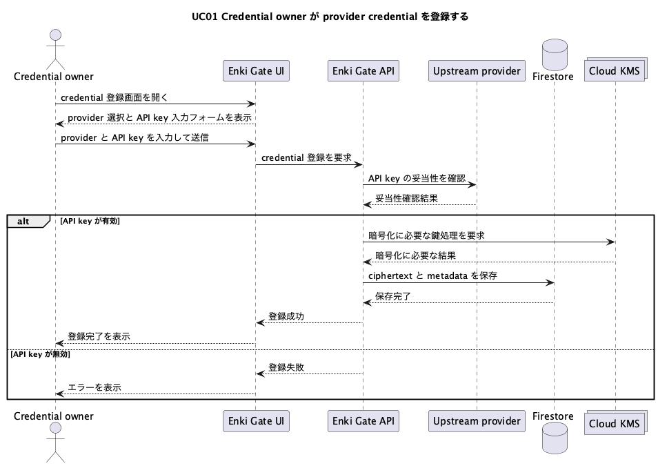
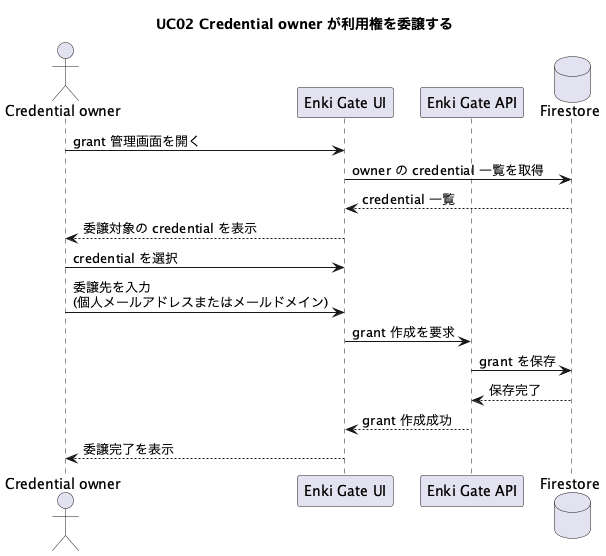
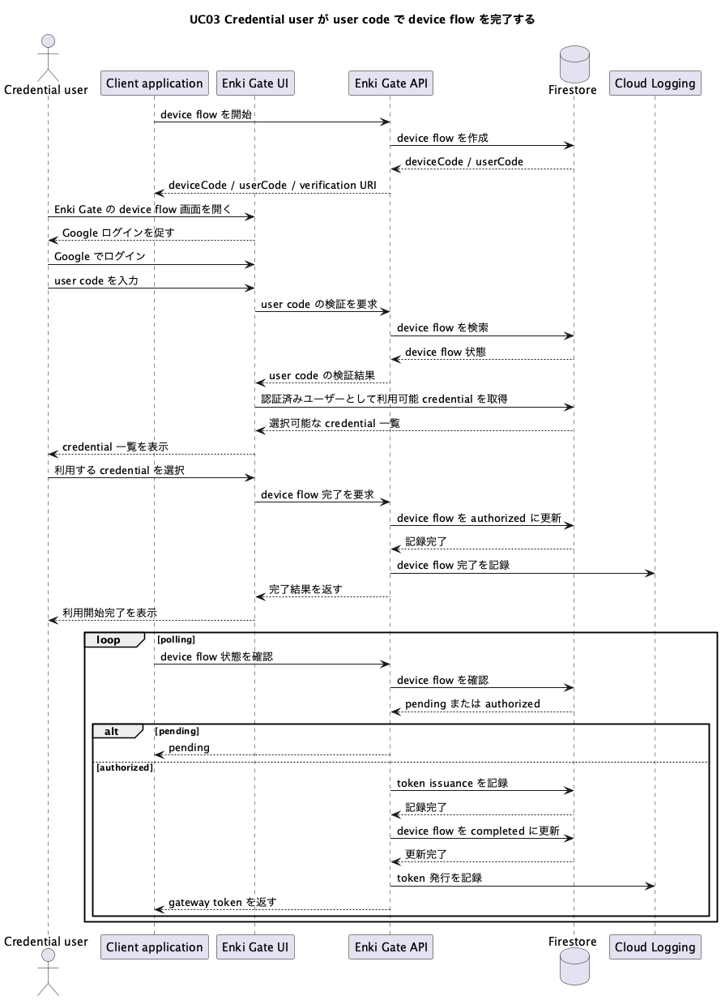
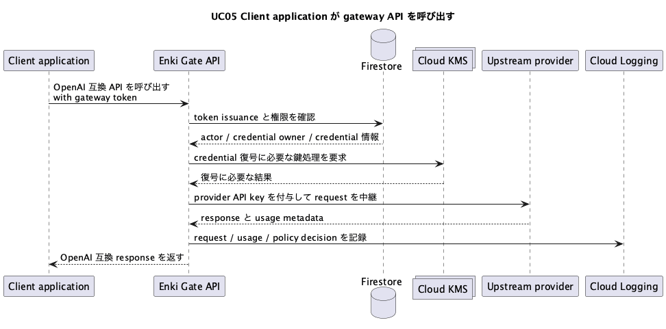
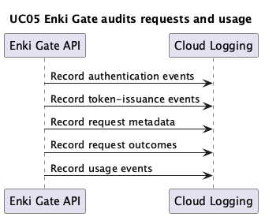
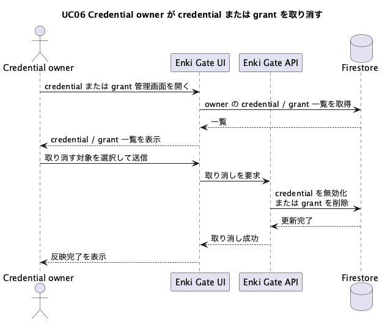

# DESIGN

## ユースケース

### 1. Credential owner が provider credential を登録する

- 主アクター: Credential owner
- 関与するもの: Enki Gate、upstream provider
- 目的: 個人の provider API key を Enki Gate に登録し、クライアントへ生の key を配らずに利用できるようにする
- 図: `docs/diagrams/uc01-register-credential.puml`

### 2. Credential owner が他の個人またはドメインに利用権を委譲する

- 主アクター: Credential owner
- 関与するもの: Enki Gate
- 目的: owner の credential を、他の個人ユーザーまたはメールドメイン全体に対して利用可能にする
- 図: `docs/diagrams/uc02-grant-access.puml`

### 3. Credential user が device flow で利用開始する

- 主アクター: Credential user
- 関与するもの: Enki Gate、Client application
- 目的: client application に表示された user code を使って認証し、利用する credential を選び、client application が gateway token を受け取れる状態にする
- 図: `docs/diagrams/uc03-issue-gateway-token.puml`

### 4. Client application が発行済み token を使って gateway を呼び出す

- 主アクター: Client application
- 関与するもの: Enki Gate、upstream provider
- 目的: provider API key を持たずに、Enki Gate 経由で OpenAI 互換 API を利用する
- 図: `docs/diagrams/uc05-call-gateway-api.puml`

### 5. Enki Gate が利用と policy decision を監査する

- 主アクター: Enki Gate
- 関与するもの: Cloud Logging
- 目的: 誰がどの credential を使い、どの client / session から利用し、どのような usage と policy outcome になったかを記録する
- 図: `docs/diagrams/uc05-audit-usage.puml`

### 6. Credential owner が credential または grant を取り消す

- 主アクター: Credential owner
- 関与するもの: Enki Gate
- 目的: credential 自体、または委譲済みの利用権を将来の利用から外す
- 図: `docs/diagrams/uc06-revoke-credential-or-grant.puml`

## Firestore コレクション設計

### `users/{uid}`

- 用途: Google ログインした個人ユーザーの正規化された情報
- 主なフィールド: `email`, `domain`, `displayName`, `photoURL`, `createdAt`, `updatedAt`
- クライアント read: 本人のみ可
- クライアント write: 本人の upsert のみ可。`email` と `domain` は認証情報と一致している必要がある
- サーバ write: 可

### `credentials/{credentialId}`

- 用途: credential の安全な metadata。平文 secret は持たない
- 主なフィールド: `ownerUid`, `ownerEmail`, `provider`, `label`, `status`, `allowedUserEmails`, `allowedDomains`, `createdAt`, `updatedAt`
- クライアント read: owner、または委譲された user / domain のみ可
- クライアント write: 不可
- サーバ write: 可

### `credential_secrets/{credentialId}`

- 用途: provider credential の暗号化済み secret
- 主なフィールド: `ownerUid`, `ciphertext`, `wrappedDek`, `kmsKeyName`, `createdAt`, `updatedAt`
- クライアント read: 不可
- クライアント write: 不可
- サーバ write: 可

### `grants/{grantId}`

- 用途: credential の委譲状態
- 主なフィールド:
  - 識別: `credentialId`, `ownerUid`, `granteeType`, `granteeValue`
  - 状態: `status`, `createdAt`, `updatedAt`, `revokedAt`
  - 利用集計: `lastAccessAt`, `usageSummary7d`, `usageUpdatedAt`
- クライアント read: owner のみ可
- クライアント write: 不可
- サーバ write: 可

### `token_issuances/{issuanceId}`

- 用途: gateway token の発行記録
- 主なフィールド: `actorUid`, `actorEmail`, `credentialId`, `credentialOwnerUid`, `tokenHash`, `issuedAt`, `expiresAt`
- クライアント read: 不可
- クライアント write: 不可
- サーバ write: 可

### `device_flows/{userCode}`

- 用途: device flow の進行状態
- 主なフィールド: `userCode`, `status`, `credentialId`, `actorUid`, `actorEmail`, `tokenHash`, `createdAt`, `expiresAt`, `authorizedAt`
- クライアント read: 不可
- クライアント write: 不可
- サーバ write: 可

## Firestore 設計上の要点

- `credentials` と `credential_secrets` は分ける。UI が参照する可能性があるのは `credentials` だけで、`credential_secrets` は常にサーバ専用にする
- `grants` は委譲の正規データかつ usage 集計の保持先として持つ
- `credentials.allowedUserEmails` と `credentials.allowedDomains` は、UI の直接クエリと Security Rules を単純に保つための派生データとして持つ
- grant の作成と取り消しは API が行い、そのたびに `grants` と `credentials.allowed*` を一緒に更新する
- grant の取り消しは物理削除ではなく論理状態遷移として扱い、usage と監査の参照に必要なレコードは保持する
- `credentials.allowed*` は active な grant だけを反映する派生データであり、revoked grant は含めない
- grant の identity は `(credentialId, granteeType, granteeValue)` で一意に定まる。`grantId` はこの組に対して安定して決まるものとして扱う
- 同じ共有先に再度共有する場合は新しい grant を増やさず、既存 grant を `revoked -> active` に戻す
- 再共有時も `createdAt` は維持し、最新の状態変更時刻は `updatedAt` に、owner が共有を止めた時刻は `revokedAt` に保持する
- `lastAccessAt` と `usageSummary7d` は grant の利用実績を示す。共有の停止後も履歴として保持し、実際の利用有無の確認はこれらと監査ログで行う
- device flow の状態は `device_flows/{userCode}` に持ち、browser 側は `userCode` で認可対象を特定する
- `deviceCode` は `device_flows` のフィールドとして保持し、client 側の polling で照合する
- `userCode` は、人間が認可対象の device flow を特定し、誤認可を避けるための確認コードとして使う
- audit log の本流は Firestore ではなく Cloud Logging に出す
- 監査ログには少なくとも `actorUid`, `actorEmail`, `credentialId`, `credentialOwnerUid`, `eventType`, `result`, `timestamp` を含める

## Grant の状態モデル

### grant の意味

- grant は「ある credential を、ある共有先に使わせる関係」そのものを表す
- 共有を止めても grant の履歴と利用実績は残す
- 共有を再開しても同じ関係の再有効化として扱い、別 grant は作らない

### grant の状態

- `active`
  - 現在有効な共有
  - `credentials.allowedUserEmails` または `credentials.allowedDomains` に反映される
  - device flow の認可対象になり得る
- `revoked`
  - owner が将来の利用を止めた共有
  - `credentials.allowed*` には反映されない
  - device flow の認可対象にはならない
  - usage 集計と監査参照のため grant record 自体は保持する

### grant のタイムスタンプ

- `createdAt`
  - その共有関係が最初に作られた時刻
  - 再共有しても更新しない
- `updatedAt`
  - grant の状態や集計以外の管理情報が最後に変わった時刻
  - revoke / 再共有では更新する
- `revokedAt`
  - owner が共有を止めた時刻
  - `status = revoked` のときにのみ意味を持つ
  - 再共有時は unset / null 相当に戻す
- `lastAccessAt`
  - その grant 経由で最後に利用が成功した時刻
  - 共有停止後も履歴として残す

### grant の再共有

- 同じ `credentialId`, `granteeType`, `granteeValue` への再共有は、既存 grant の再有効化として扱う
- 再共有時に新しい grant record や新しい grantId は作らない
- 再共有時は `status = active`, `updatedAt` 更新, `revokedAt` 解除を行う
- `createdAt`, `lastAccessAt`, `usageSummary7d` は保持する

### grant と利用実績

- grant の利用実績は `lastAccessAt`, `usageSummary7d`, `usageUpdatedAt` に集約する
- grant を物理削除すると共有関係に紐づく統計が失われるため、revoke では削除しない
- 実際に使われていたか、いつ止められたかは grant record と監査ログを併せて判断する

## Security Rules の方針

### `users`

- 本人だけが read できる
- 本人だけが create / update できる
- `email` と `domain` は `request.auth` と一致しなければならない

### `credentials`

- owner は read 可
- `allowedUserEmails` に自分の email が含まれる場合は read 可
- `allowedDomains` に自分の domain が含まれる場合は read 可
- クライアント write は不可

### `credential_secrets`

- クライアントからの read / write は常に不可

### `grants`

- owner だけが read 可
- クライアント write は不可

### `token_issuances`

- クライアントからの read / write は常に不可

### `device_flows`

- クライアントからの read / write は常に不可

## 画面設計

### 画面一覧

#### 1. サインイン画面

- 目的: Google ログインを開始する
- 主な要素: サービス説明、`Sign in with Google`
- 遷移先: 利用開始画面、またはログイン前に要求されていた画面

#### 2. ホーム画面

- 目的: Enki Gate の主要機能への入口をまとめる
- 主な要素: Credential 管理への導線
- 遷移先: 各管理画面

#### 3. Credential 一覧画面

- 目的: 自分が登録した provider credential を確認する
- 主な要素: credential 一覧、`新規登録`、`詳細`、`無効化`
- 遷移先: Credential 登録画面、Credential 詳細画面

#### 4. Credential 登録画面

- 目的: provider credential を登録する
- 主な要素: provider 選択、API key 入力、ラベル、`登録`
- 遷移先: Credential 一覧画面

#### 5. Credential 詳細画面

- 目的: credential の詳細、共有状態、共有履歴、grant ごとの利用状況を確認し、共有の停止や再共有を管理する
- 主な要素:
  - credential 情報
  - 状態付き grant 一覧
  - grant ごとの usage 情報
  - `委譲追加`
  - grant の状態に応じた `取り消し` または `再共有`
  - `無効化`
- 遷移先: Grant 作成画面

#### 6. Grant 作成画面

- 目的: 個人またはドメインに対して利用権を委譲する
- 主な要素: 委譲先入力、`作成`
- 遷移先: Credential 詳細画面

#### 7. Device flow 認可画面

- 目的: user code を入力し、利用する credential を選んで device flow を完了する
- 主な要素: user code 入力、利用可能 credential 一覧、`この credential を使う`
- 遷移先: 完了画面

#### 8. Device flow 完了画面

- 目的: client application 側で利用開始できる状態になったことをユーザーに伝える
- 主な要素: 完了メッセージ
- 遷移先: なし

### 主要遷移

#### 通常操作

- サインイン画面 -> ホーム画面
- ホーム画面 -> Credential 一覧画面

#### Credential 管理

- Credential 一覧画面 -> Credential 登録画面
- Credential 一覧画面 -> Credential 詳細画面
- Credential 登録画面 -> Credential 一覧画面
- Credential 詳細画面 -> Grant 作成画面
- Grant 作成画面 -> Credential 詳細画面

#### Device flow

- Client application -> user code 表示
- user code 表示 -> サインイン画面
- サインイン画面 -> Device flow 認可画面
- Device flow 認可画面 -> Device flow 完了画面

### 画面設計上の前提

- token をユーザーに手でコピーさせない
- 利用開始は device flow で完結させる
- 一覧取得は可能な限り Firestore 直読みを前提にする
- 状態変更は監査のため API 経由に寄せる
- Credential 詳細画面の grant 一覧は active / revoked の両方を表示対象とし、現在の共有状態と過去の共有履歴を同じ資源として扱う
- grant 一覧には少なくとも共有先、状態、利用状況、主要な時刻情報を表示し、取り消し後も usage と監査上の参照を失わない

## 外部インターフェース設計

### 設計方針

- 一覧取得のような状態参照は、可能な限り Firestore 直読みで行う
- 状態変更、token 発行、provider 通信、監査を伴う処理は API 経由で行う
- 管理 API は Firebase Authentication による認証済みユーザーを前提とする
- 利用開始は device flow で行う

### Browser Flow

#### `GET /device`

- 用途: user code の入力画面を表示する
- 認証: 不要
- 主な処理:
  - 未認証ならサインイン画面へ進める
  - 認証済みなら device flow 認可画面を表示する
  - user code に対応する認可対象を人間が確認できるようにする

### Device Flow API

#### `POST /api/device-flows`

- 用途: client application が device flow を開始する
- 認証: 不要
- 主な処理:
  - `device_flows/{userCode}` を作成する
  - `device_code`, `user_code`, `verification_uri`, `expires_in` を返す
- 仕様:
  - `expires_in` は 600 秒
  - `interval` は 5 秒
- レスポンス:
  - `device_code`
  - `user_code`
  - `verification_uri`
  - `expires_in`
  - `interval`

#### `POST /api/device-flows/{deviceCode}/poll`

- 用途: client application が device flow の完了を待つ
- 認証: 不要
- 主な処理:
  - `deviceCode` に対応する device flow の状態を確認する
  - authorized なら 1 時間有効な gateway token を発行する
  - `token_issuances/{issuanceId}` を記録する
  - `device_flows/{userCode}` を completed に更新する
  - 監査イベントを出す
- レスポンス:
  - pending か completed か
  - completed の場合は `access_token`, `token_type`, `expires_in`
- 仕様:
  - pending の間は token を返さない
  - expired の場合は失敗を返す
  - completed になった device flow では再発行しない

#### `POST /api/device-authorizations`

- 用途: ブラウザ上で認証済みユーザーが user code と credential 選択により device flow を完了する
- 認証: 必須
- リクエスト:
  - `user_code`
  - `credential_id`
- 主な処理:
  - `user_code` に対応する device flow を検証する
  - actor がその credential を利用可能であることを確認する
  - device flow を authorized 状態にする
  - 監査イベントを出す
- レスポンス:
  - `userCode`
  - `credentialId`
  - `status`

### Credential 管理 API

#### `POST /api/credentials`

- 用途: provider credential を登録する
- 認証: 必須
- リクエスト:
  - `provider`
  - `label`
  - `apiKey`
- 主な処理:
  - upstream provider で API key を検証する
  - API key を暗号化する
  - `credentials/{credentialId}` と `credential_secrets/{credentialId}` を作成する
  - 監査イベントを出す
- レスポンス:
  - `credentialId`
  - `provider`
  - `label`
  - `status`

#### `POST /api/credentials/{credentialId}/disable`

- 用途: credential を論理削除する
- 認証: 必須
- 主な処理:
  - owner であることを確認する
  - `credentials/{credentialId}` を無効化する
  - 監査イベントを出す
- レスポンス:
  - 更新後の credential

### Grant 管理 API

#### `POST /api/credentials/{credentialId}/grants`

- 用途: credential の利用権を委譲する
- 認証: 必須
- リクエスト:
  - `granteeType`
  - `granteeValue`
- 主な処理:
  - owner であることを確認する
  - `(credentialId, granteeType, granteeValue)` に対応する `grantId` を解決する
  - 既存 grant がなければ `grants/{grantId}` を作成する
  - 既存 grant が `revoked` なら `active` に戻す
  - `credentials.allowedUserEmails` または `credentials.allowedDomains` に対象を反映する
  - 監査イベントを出す
- レスポンス:
  - `grantId`
  - `credentialId`
  - `granteeType`
  - `granteeValue`

#### `POST /api/grants/{grantId}/revoke`

- 用途: 委譲済み grant を取り消す
- 認証: 必須
- 主な処理:
  - owner であることを確認する
  - `grants/{grantId}` を `revoked` に更新する
  - `updatedAt` と `revokedAt` を記録する
  - `credentials.allowedUserEmails` または `credentials.allowedDomains` から対象を外す
  - grant 自体の usage 集計と監査参照に必要な情報は保持する
  - 監査イベントを出す
- レスポンス:
  - `grantId`
  - `status`

### OpenAI 互換 API

#### `POST /v1/chat/completions`

- 用途: OpenAI 互換の chat completions を受ける
- 認証: gateway token 必須
- 主な処理:
  - gateway token を検証する
  - `token_issuances` から actor、credential owner、credential を解決する
  - policy を評価する
  - provider credential を復号する
  - upstream provider に中継する
  - usage、cost、policy decision を監査ログへ出す

#### `POST /v1/responses`

- 用途: OpenAI 互換の responses API を受ける
- 認証: gateway token 必須
- 主な処理:
  - `POST /v1/chat/completions` と同様

### Hosting と Functions のルーティング

- `/api/**` は Management API と Device Flow API に渡す
- `/v1/**` は OpenAI 互換 API に渡す
- それ以外は Hosting の SPA として `index.html` を返す
- 画面の `/device` と API の `/api/device-authorizations` は path を分ける

### Management API と Firestore 直読みの境界

- Firestore 直読み:
  - `users`
  - owner 自身の `grants`
  - owner または委譲先として参照可能な `credentials`
- Management API 経由:
  - credential 登録、無効化
  - grant 作成、取り消し
- Device Flow API:
  - device flow 開始
  - device flow 認可
  - polling と gateway token 発行
- OpenAI 互換 API:
  - OpenAI 互換 API 呼び出し
